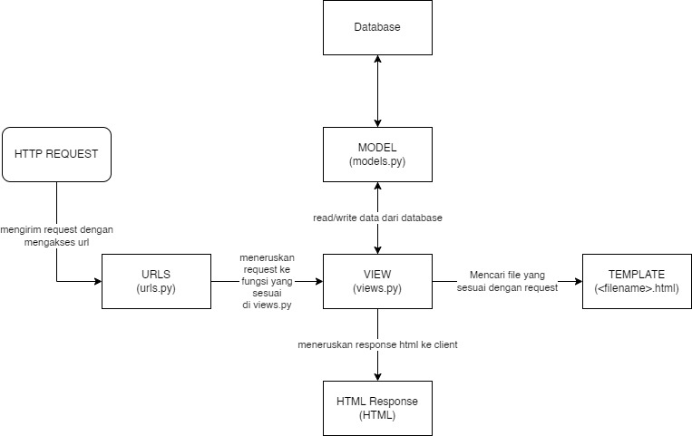

# Link menuju katalog dan home page
[Home page](https://lab02pbp.herokuapp.com/)

[Katalog page](https://lab02pbp.herokuapp.com/katalog/)

# Diagram

# Kenapa menggunakan virtual envinronments? Dapatkah tetap membuat django app?
Karena dengan menggunakan virtual environtment otomatis kita melakukan instalasi packages dan dependencies yang diperlukan dalam framework django yang tidak terinstalasi secara global di local. jika tidak menggunakan virtual environtment, kita hanya bisa sebatas mengakses dari folder/direktori yang telah terinstal. Dengan virtual environtment kita juga dapat membuat lingkungan kerja python yang terisolasi sehingga tidak menganggu ketika kita memiliki project yang banyak.

Virtual envinronment biasa digunakan untuk sebuah project berbasis python. Karena setiap mempunyai kebutuhan / dependent yang berbeda-beda antara satu dengan lainnya, maka dibutuhkanlah sebuah virtual environment untuk menjalankannya. Dengan tujuan untuk agar tidak merubah configurations pada system operasi yang kita pakai. Saat menggunakan virtual envinronments secara otomatis akan menginstall packages dan dependencies yang diperlukan dala framework djago. Packages dan dependencies ini tidak terinstalasi secara global di local. Secara singkat, saat kita membuat virtual envinronment, kita akan membuat lingkungan python yang terisolasi, yaitu tidak dapat diakses dari dunia luar. Oleh karena itu, sebenarnya kita masih tetap bisa membuat django app tanpa virtual envinronment.

# Cara mengimplementasi

1. semua data dari json diambil oleh views.py menggunakan syntax CatalogItem.objects.all() dari variable data_barang_katalog. Data ini ada pada fungsi show_katalog(request). Data ini akan dikembalikan ke dalam HTML menggunakan render().

2. Untuk memetakan fungsi pada views.py, harus dibuat sebuah routing. Caranya adalah dengan mamasukkan sebuah path pada folder katalog file urls.py. caranya dengan path('', show_katalog, name='show_katalog'). Pada folder project django juga menambahkan path('katalog/', include('katalog.urls')). Dengan ini, ketika terdapat client request terhadap URL katalog, fungsi show_katalog(request) akan dipanggil.

3. loaddata json akan memasukkan data didalamnya ke dalam database django lokal. Dengan perintah CatalogItem.objects.all(), kita akan mengambil data tersebut lalu akan render dengan render (___)

4. Dengan membuat file Procfile untuk mengatur deployment di Heroku. Dan selanjutnya adalah membuat _new app_ di Heroku dan import repo tugas 2 ini dari GitHub ke Heroku untuk di-deploy. jangan lupa menambahkan api values dan api name pada settingan repository github tugas 2. 

4. Cara deploynya adalah dengan membuat new app. kemudian import tugas 2 dari repo yang sudah dibuat di github ke heroku. Tambahkan repository secret memakai nama aplikasi dan juga API Key dari heroku. Lalu dengan add, commit, dan push, maka aplikasi akan di deploy.