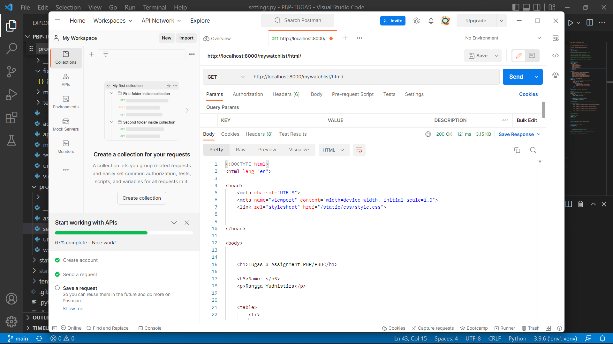
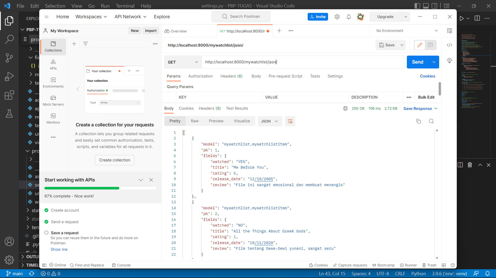
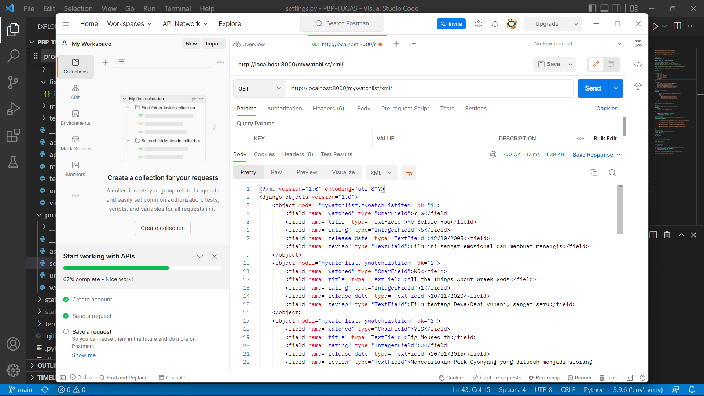

# Link menuju home page dan mywatchlist
[Home page](https://lab02pbp.herokuapp.com/)

[MyWatchlist page](https://lab02pbp.herokuapp.com/mywatchlist/)

# Jelaskan perbedaan antara JSON, XML, dan HTML!
JSON, XML, dan HTML adalah sebuah data delivery yang memiliki perbedaan antara satu sama lain. 

Beberapa contohnya adalah:
HTML :  1. Di pasaran didukung oleh banyak browser
        2. Bisa ditambahkan comments
XML :   1. Tidak terlalu didukung oleh browser. Terkadang untuk melakukan parse XML terasa sulit.
        2. Bisa ditambahkan comments
        3. Mendukung Array
JSON :  1. Didukung oleh banyak browser
        2. Tidak bisa ditambahkan comments
        3. Tidak mendukung array    

# Jelaskan mengapa kita memerlukan data delivery dalam pengimplementasian sebuah platform?
Karena data delivery berguna sebagai suatu format penyimpanan data. Hal ini penting dalam pengimplementasian sebuah platform karena dalam membuat platform kita akan mengakses database. Kita akan sering melakukan pengiriman atau transmisi data dari web aplikasi yang kita buat. Contohnya ketika ingin mentransmisikan data antara server dan web aplikasi.

# Implementasi
1. Pembuatan aplikasi mywatchlist dengan perintah python manage.py startapp mywatchlist

2. Mendaftarkan aplikasi wishlist ke dalam proyek django dengan cara akses INSTALLED_APPS yang ada pada berkas settings.py pada folder django, kita tambahkan 'mywatchlist'

3. Selanjutnya dengan membuat model MyWatchList. Lalu implementasikan kode berupa menambahkan atribut watched, title, rating, release_date, dan review.

4. Lakukan perintah python manage.py makemigrations lalu python manage.py migrate. untuk mempersiapkan migrasi skema model yang kemudian akan diterapkan dalam database Django lokal.

5. Membuat sebuah berkas bernama watchlist_data.json yang akan memiliki isi list movie. Berkas ini akan memiliki format data delivery json.

6. Kemudian, dengan perintah python manage.py loaddata watchlist_data.json berguna untuk memasukkan data tersebut ke dalam database Django lokal.

7. Dalam folder mywatchlist tambahkan lagi folder templates dan tambahkan berkas watchlist.html yang akan menampilkan data json yang diubah ke html.

8. Pembuatan routing. Pembuatan routing bertujuan agar data yang sudah dibuat dapat diakses melalui URL yang sesuai. Hal ini dilakukan dengan menambahkan path() ke dalam variabel urlpatterns pada urls.py pada folder mywatchlist. penambahan yang dilakukan seperti :
path('html/', show_mywatchlist, name='show_mywatchlist')
path('xml/', show_xml, name='show_xml')
path('json/', show_json, name='show_json')

9. Deployment ke Heroku. Kita perlu mendeploy ke HeroKu agar aplikasi mywatchlist yang sudah dibuat dapat diakses melalui internet bukan hanya dari local saja. Karena pada tugas sebelumnya deployment sudah dilakukan, maka pada tugas kali ini tinggal menyesuaikan saja procfilenya dengan menambahkan " ...python manage.py loaddata initial_mywatchlist_data.json" pada bagian "release: " di procfile.

10. Penambahan unit test pada test.py. Hal ini bertujuan untuk melakukan pengujian URL dapat mengembalikan respon HTTP 200 OK.

# AKSES URL DENGAN POSTMAN

